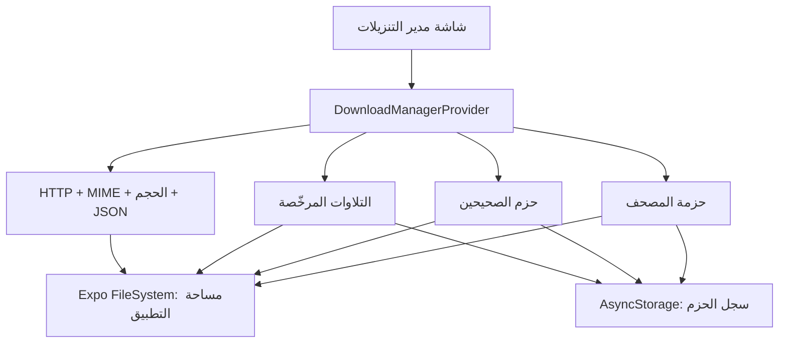

# نظام التنزيلات في سَكينة

> **الغرض:** توثيق بنية تنزيل حزم المحتوى والتلاوات المرخّصة، وطريقة إدارة حالتها محليًا، وحدود الربط بقاعدة بيانات بعيدة.

## 1. نظرة عامة

يبقى نظام التنزيلات في سَكينة **محليًا أولًا**. لا يحتاج المستخدم إلى حساب ولا يرسل سجل قراءته أو ملفاته إلى خادم. تحفظ الملفات في مساحة التطبيق الخاصة، بينما تحفظ بيانات الفهرسة الخفيفة في `AsyncStorage`. تعرض شاشة **مدير التنزيلات** حالة الحزم والتلاوات، والتقدم، والإلغاء، وإعادة المحاولة، والحذف.



| الطبقة | الملف أو المكوّن | المسؤولية |
|---|---|---|
| الواجهة | `app/downloads.tsx` | عرض البطاقات، شريط التقدم، الإلغاء، الحذف، وإعادة المحاولة |
| الحالة المركزية | `lib/download-manager.tsx` | تتبع المهام النشطة والملفات المكتملة وإعادة فحص الملفات عند الفتح |
| التحقق | `lib/download-validation.ts` | قبول HTTP الناجح ونوع المحتوى والحجم قبل تسجيل نجاح التنزيل |
| حزم النص | `lib/quran-pack.ts` و`lib/hadith-packs.ts` | تنزيل المصحف والصحيحين وقراءة الحزمة وحذفها |
| الصوت | `lib/audio-downloads.ts` | تنزيل التلاوة وفحصها وحفظ ميتاداتا التسجيل وحذفه |
| الوصول الآمن | `lib/security.ts` | السماح فقط بروابط HTTPS من المضيفات الموثوقة |

## 2. مسار تنزيل موحد

تبدأ الواجهة عبر `startContent` أو `startAudio`. تنشئ طبقة الحزمة `FileSystem.DownloadResumable` ثم تمرر مرجع المهمة إلى مدير التنزيلات. يستقبل المدير تحديثات النسبة، ويحدّث البطاقة مع خنق زمني بسيط بدل تحديث React لكل حدث شبكة.

```text
ضغط تنزيل
  → إنشاء DownloadResumable
  → حفظ المرجع المؤقت للمهمة
  → تحديث نسبة التقدم بتردد محدود
  → فحص HTTP / MIME / الحجم / JSON
  → حفظ الملف وسجل الميتاداتا عند النجاح
  → تنظيف الملف والسجل عند الفشل أو الإلغاء
```

### واجهة الوظائف الأساسية

| الوظيفة | المعنى |
|---|---|
| `downloadQuranPack(onProgress, onTask)` | تنزيل المصحف كاملًا إلى مساحة التطبيق |
| `downloadHadithPack(id, onProgress, onTask)` | تنزيل حزمة البخاري أو مسلم |
| `downloadRecitation(recording, onProgress, onTask)` | تنزيل تلاوة مرخّصة بامتداد صوت صحيح |
| `cancel(id)` | إلغاء المهمة النشطة المرتبطة بالمعرّف |
| `remove(item)` | حذف الملف المحلي وسجل الميتاداتا المرتبط به |
| `refresh()` | إعادة فحص السجلات والملفات الموجودة واستعادة حالة المكتمل |

## 3. السلامة الذاكرية وتحديثات التقدم

تعالج `DownloadManagerProvider` ثلاثة مخاطر مرتبطة بالتنزيلات الطويلة:

1. **تحديث حالة بعد تفكيك المكوّن:** يحتفظ المزود بالمرجع `mounted`. جميع تغييرات `items` تمر عبر `safelySetItems`، ولا تنفذ عندما يكون المزود قد فُكك.
2. **احتفاظ مهمة الشبكة بعد مغادرة التطبيق:** يحتفظ المرجع `tasks` بالمهام النشطة فقط. في دالة تنظيف `useEffect` تلغى جميع المهام، ثم يفرغ المرجع.
3. **إعادة رسم مفرطة من التقدم:** تستخدم `shouldPublishProgress` فاصلًا زمنيًا قدره 120 مللي ثانية بين التحديثات، مع نشر البداية والنهاية فورًا. هذا يبقي شريط التقدم سلسًا ويقلل عمليات إعادة الرسم.

> لا يحتفظ مدير التنزيلات بنتائج شبكة كبيرة داخل حالة React. تخزن الحالة فقط العنوان والنوع والنسبة والحجم ورسالة الخطأ، بينما يبقى الملف على نظام ملفات التطبيق.

## 4. الإلغاء والتنظيف

يستدعي زر الإلغاء `DownloadResumable.cancelAsync()`. تتعامل طبقات الحزم والصوت مع رفض الوعد بحذف الملف المؤقت ومسح سجل الميتاداتا. لا تسجل الحزمة كـ«مكتملة» إلا بعد نجاح التحقق.

| الحالة | واجهة المستخدم | أثر التخزين |
|---|---|---|
| `downloading` | شريط تقدم وزر إلغاء | ملف مؤقت قد يكون موجودًا |
| `completed` | الحجم وزر حذف | ملف صالح وسجل ميتاداتا |
| `cancelled` | رسالة إلغاء وزر تنزيل مجددًا | حذف الملف الجزئي |
| `failed` | رسالة خطأ وزر إعادة المحاولة | حذف الملف أو السجل غير الصالح |

## 5. التخزين المحلي الحالي

لا توجد قاعدة بيانات بعيدة مطلوبة لتشغيل التنزيلات. تعتمد النسخة الحالية على مساحة التطبيق الخاصة و`AsyncStorage`:

| المورد | ملف المحتوى | مفتاح الميتاداتا |
|---|---|---|
| المصحف | `sakinah-quran-uthmani.json` داخل `documentDirectory` | `sakinah.quran-pack.v1` |
| صحيح البخاري | ملف JSON داخل مجلد حزم التطبيق | `sakinah.hadith-pack.bukhari.v1` |
| صحيح مسلم | ملف JSON داخل مجلد حزم التطبيق | `sakinah.hadith-pack.muslim.v1` |
| التلاوات | مجلد `sakinah-recitation/` داخل `documentDirectory` | `sakinah.recitation-downloads.v1` |

يحتوي سجل كل تنزيل على رابط المصدر وتاريخ التنزيل والحجم ومسار الملف المحلي. مسار الملف المحلي **خاص بالجهاز** ولا يجوز مزامنته مباشرة مع خادم أو جهاز آخر.

## 6. ربط اختياري بقاعدة البيانات

لا ينبغي أن يصبح الربط بقاعدة البيانات شرطًا للتنزيل المحلي. إن أضيفت حسابات المستخدمين لاحقًا، يكون الربط الصحيح هو مزامنة **التفضيلات والميتاداتا غير الحساسة** فقط، لا رفع ملفات القرآن أو التلاوات ولا مسارات `documentDirectory`.

### نموذج مقترح

```sql
create table download_preferences (
  user_id uuid not null,
  content_key text not null,
  source_url text not null,
  expected_version text,
  preferred_offline boolean not null default true,
  updated_at timestamptz not null default now(),
  primary key (user_id, content_key)
);
```

| حقل | يستخدم لـ | لا يستخدم لـ |
|---|---|---|
| `content_key` | تعيين اختيار المستخدم لحزمة أو تلاوة | مسار ملف محلي |
| `source_url` | التحقق من مصدر النسخة المطلوبة | تحميل ملف المستخدم إلى الخادم |
| `expected_version` | اكتشاف تحديث المحتوى | تتبع وقت القراءة أو سلوك المستخدم |
| `preferred_offline` | استعادة رغبة المستخدم على جهاز جديد | فرض تنزيل تلقائي بلا موافقة |

### تدفق مزامنة آمن

1. يسجل المستخدم اختياره للتنزيل محليًا أولًا.
2. عند توافر حساب واختيار المستخدم للمزامنة، يحفظ التطبيق `content_key` و`source_url` ونسخة المحتوى فقط.
3. على جهاز جديد تظهر العناصر كمقترحة للتنزيل ولا تبدأ تلقائيًا.
4. يعيد الجهاز الجديد تنزيل الملف من المصدر الموثق مباشرة ويمرره من تحقق HTTP/MIME/الحجم المعتاد.

## 7. اختبارات الصيانة

| التحقق | الغاية |
|---|---|
| `tests/download-validation.test.ts` | رفض HTTP 429 والملفات الصغيرة وغير الصوتية |
| `tests/download-manager-utils.test.ts` | التأكد من خنق تحديثات التقدم مع نشر البداية والنهاية |
| `pnpm check` | سلامة الأنواع بين الواجهة ومدير التنزيل وواجهة Expo |
| `npx expo export --platform android` | التأكد من تجميع مسار Android |

## 8. نقاط تطوير لاحقة

1. إضافة قائمة انتظار لتنزيل عنصر واحد في الوقت نفسه على الشبكات الضعيفة.
2. حفظ حالة التنزيل القابل للاستئناف عبر `DownloadResumable.savable()` عندما تؤكد اختبارات الهاتف سلوكه في بيئات Android المستهدفة.
3. إضافة قياس مساحة التخزين الحرة قبل بدء الحزم الكبيرة، مع عدم جمع هذه المعلومة خارج الجهاز.
